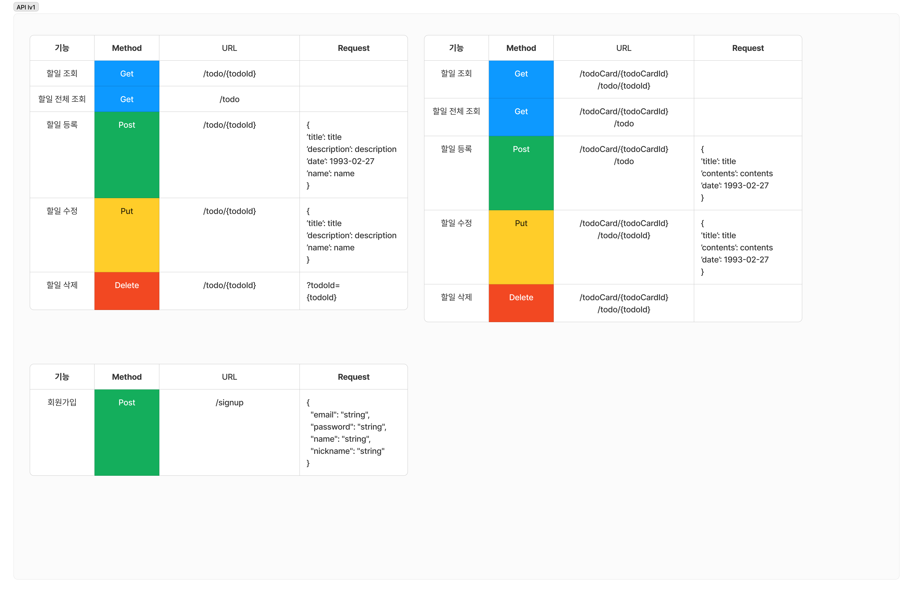
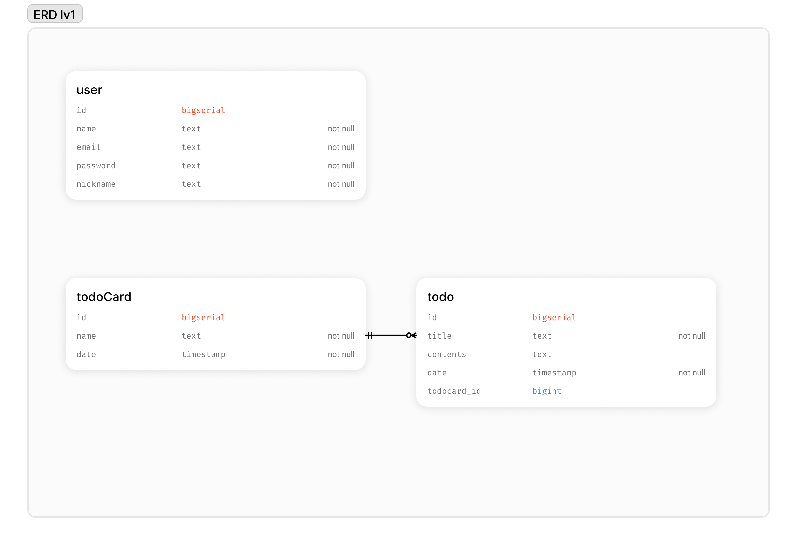

Todo Application
=====

## Todo Application Version 1.0
> * 담당자 : 오재영
> * 개발 기간 : 2023.12.20 ~ 2023.12.29


## 프로젝트 소개
Todo Application의 API를 개발하는 프로젝트입니다.


## 시작 가이드

### Requirements
For building and running the application you need:
* Spring 3.1.6

### Installation
```bash
$ git clone https://github.com/JYOH3246/TodoApplication.git
$ cd todoApplication
```
## Stack
<div>
  
  
  
  
  
  <br>
</div>

## API Documents


## ERD

